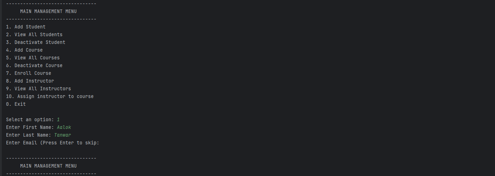

# Setup Instructions

### Environment
- **JDK Version**: Java 21 (Eclipse Temurin)
- **Build Tool**: Maven 3.9.9

### Running the Program
1. Open your terminal or IDE (IntelliJ/Eclipse).
2. Run the `Main.java` file.
3. You will see the "MAIN MANAGEMENT MENU".
4. To test, first select **Option 1** to add a student, then **Option 4** to add a course. Use **Option 7** to link them.

### "Hello World" Verification
The program begins with a greeting:
> "Welcome to LearnTrack: Student and Course Management System"
This confirms the JVM is correctly executing the bytecode and the `Main` class is reachable.
> 
> 
> 