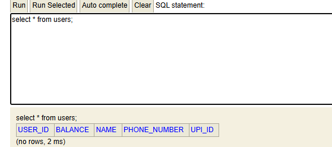
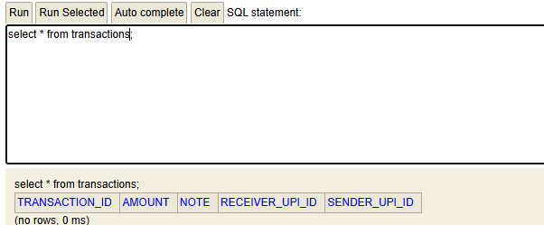
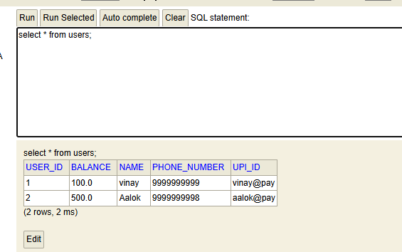
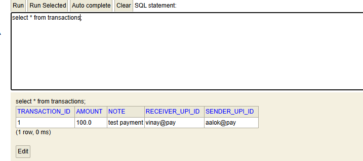

### Architecture layers
- Entity: Define data models (User, Transaction) mapped to database tables using JPA annotations.
- Repository: Interface for data access operations, extending JpaRepository that handles database tables using Jpa annotations.
- Service: Contains business logic. It manages transactions and data validation.
- Controller: Handles HTTP requests and responses. Maps URLs to service methods and handles JSON serialization.

### Spring Boot Features in PayFlow Project
- Embedded Server: The app runs an embedded Tomcat server. We do not need to deploy a WAR file to an external server, running main() starts the server immediately.
- Auto-Configuration: Spring Boot automatically configures the application based on the dependencies present in the classpath. For example, it sets up JPA and Hibernate configurations without requiring explicit configuration files.
- Production-Ready Defaults: Features like H2 Console and default logging levels are enabled automatically, allowing us to inspect the DB and debug without extra setup. 

### Repository Query Analysis
Method Name: `findByUpiId`
```sql
select u1_0.user_id,u1_0.balance,u1_0.name,u1_0.phone_number,u1_0.upi_id from users u1_0 where u1_0.upi_id=?
```
Explanation: 
a) JPA parses the method name `findByUpiId`. It sees `findBy` identifies `UpiId` as the property name, and automatically generates a `WHERE upi_id = ?` clause.
b) The `?` placeholder represents a parameter that will be provided at runtime. When the method is called, the actual value for `upi_id` will replace the `?` in the SQL query, allowing for dynamic querying based on user input.


#### Register User (without @RequestBody)
If you send a POST request with form data while the method expects @RequestBody, the fields in Java Object will be null because default message converter (Jackson) cannot map the raw input to the object properties.


### Conceptual Write Up
1. Request LifeCycle: When the curl sends a POST /users, the request hits the embedded Tomcat server and is intercepted by the DispatcherServlet. 
The DispatcherServlet consults the HandlerAdapter to find which controller method the URL and HTTP verb. It then instantiates the UserController, invokes
registerUser, which delegates to UserService then UserRepository. The Repository executes the SQL, the data is saved and the response travels back up the chain, 
get serialized to JSON by Spring's HttpMessageConverter, and sent back to the client.

2. Serialization: The component that converts the JSON payload {"name":"Priya","upiId":"priya@okaxis"} into a User object is Jackson ObjectMapper (via MappingJackson2HttpMessageConverter).
If the json key is upi_id instead of upiId the default deserialization will likely leave the upiId field as null unless a specific
naming strategy (like PropertyNamingStrategy.SNAKE_CASE) is configured in the ObjectMapper.

3. Spring vs Spring Boot: If I had used plain Spring instead of Spring Boot, I would have had to manually configure the DispatcherServlet in a web.xml file or via Java 
configuration, set up the ApplicationContext (defining all beans like the DataSource, TransactionManager, and ViewResolvers) and manage the embedded server (like Tomcat)
as a separate external dependency to deploy a WAR file. Spring Boot eliminates this boilerplate by using auto-configuration to automatically detect classpath dependencies and 
configure necessary beans, providing an embedded server that run directly from main method enforcing production-ready defaults for logging and monitoring 
without any XML or manual configuration.

4. Stateless REST: Stateless means that the server does not store any client context or session data between requests; every request
from a client must contain all the information needed to process that request (eg. authentication token in headers not server side session ids). 
This matters critically if PayFlow runs on three servers behind a load balancer because any server can handle any request without needed
to know which server handled the previous request. If the system were stateful (storing data in memory on a specific server) a user's
next request might be routed to a different server that lacks their session data, causing errors. With statelessness
the load balancer can distribute traffic freely, ensuring scalability and fault tolerance.

5. Persistence: If I had stored transactions in a simple Java List (in-memory) and then restarted the server, all transaction records would be 
permanently lost because a List exists only in the RAM of the running JVM and is wiped out when the process stops. This is completely unacceptable 
for a payments app because financial transactions are permanent legal and financial records; losing them would mean users could not verify their balance, 
disputes could not be resolved, and the system would fail to provide an audit trail, leading to financial inaccuracies, loss of user trust, and potential regulatory violations. 
A database like H2 (or a real production DB) ensures data durability, meaning records survive server restarts, crashes, and power outages.

Hibernate: create table transactions (amount float(53) not null, transaction_id bigint generated by default as identity, note varchar(255), receiver_upi_id varchar(255) not null, sender_upi_id varchar(255) not null, primary key (transaction_id))
Hibernate: create table users (balance float(53), user_id bigint generated by default as identity, name varchar(255), phone_number varchar(255), upi_id varchar(255) unique, primary key (user_id))







In your README, paste the SQL JPA generates for findByUpiId and explain: (a) how JPA derives it from the method name, and (b) what the ? placeholder means.






Hibernate: select u1_0.user_id,u1_0.balance,u1_0.name,u1_0.phone_number,u1_0.upi_id from users u1_0 where u1_0.upi_id=?